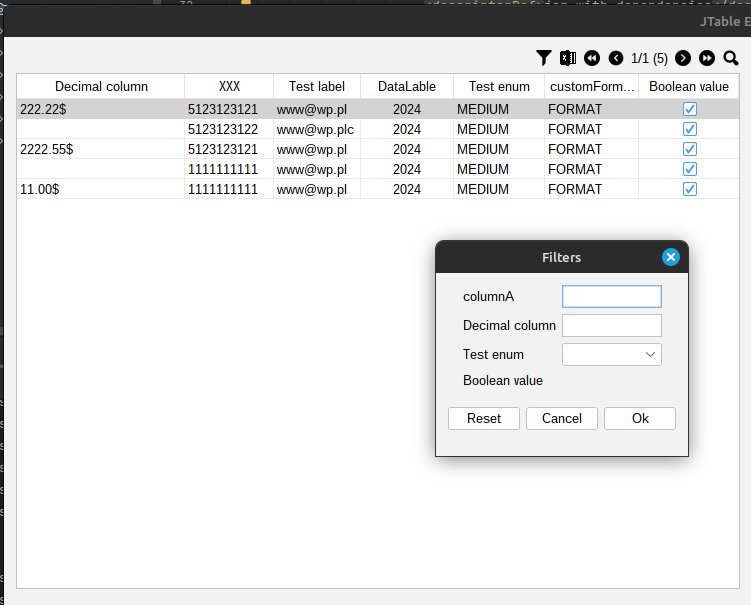

Simple tool to map Entity to jtable in java 
@Author Kamil Krzywanski <br>

Examples of usage yuo can find in:
directory: [typedTableExamples](typedTableExamples)

-Autosave of columns visibility and width -> [autoSave](typedTable/features/table/autosave/autosave.md)
-You can hide columns -> [hideColumn](typedTable/features/table/hideColumn/hideColumn.md) <br>
-Add filters, custom filters -> [filters](typedTable/features/table/filters/filters.md) <br>
-Export to excel, csv <br>
-Define sortables columns -> [sorting](typedTable/features/table/sorting/sorting.md) <br>
-Simlplify add custom formatters -> [formatters](typedTable/features/table/customFormatters/customFormatters.md) <br>
-Custom renderers for fields with
annotation -> [customRenderers](typedTable/features/table/customRenderers/customRenderers.md) <br>
-Add computed columns (functional
style) -> [computedColumns](typedTable/features/table/computedColumns/computedColumns.md) <br>
-Add column with multiselect for selecting rows (objects<T>) - pagination
friendly -> [multiSelect](typedTable/features/table/multiSelect/multiSelect.md) <br>
-Add translation for columns -> [translation](typedTable/features/table/translation/translation.md) <br>

It's olny idea at the moment but by annotations you can create simple table
like there with export to CSV, EXCEL, Sort mechanism: 
@annotation @MyTableColumn make entity "table-friendly"

With default constructor you can provide data from list of entities

Effect of this opperation will be: <br>

Custom formatter for objects example:


Incoming features:
- crud operations on table
- create of crud panel for table


Test environment:
- to run test database you need to have docker installed and run command:
```docker-compose up -d```

- application is located in typedTable directory
- example of usage is located in typedTableExamples directory

