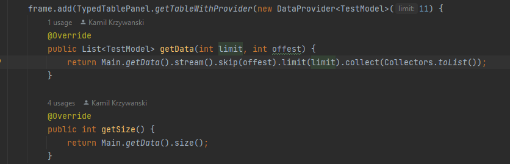
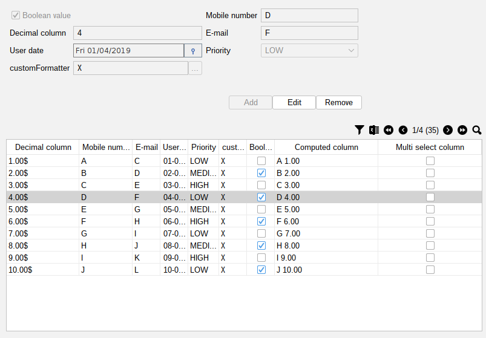
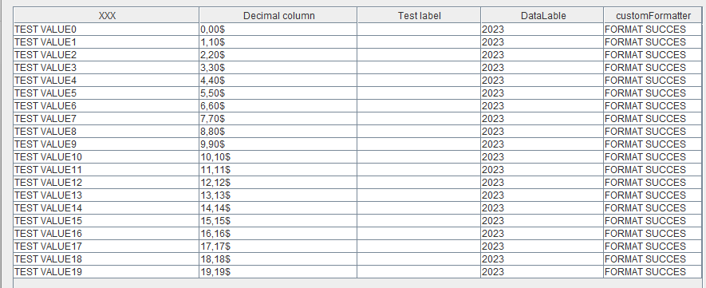

Simple tool to map Entity to jtable in java 
@Author Kamil Krzywanski

It's olny idea at the moment but by annotations you can create simple table
like there: 
@annotation @MyTableColumn make entity "table-friendly"

With default constructor you can provide data from list of entities

Effect of this opperation will be:  

Custom formatter for objects example:

Effect: 
