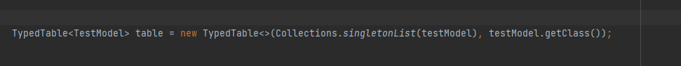
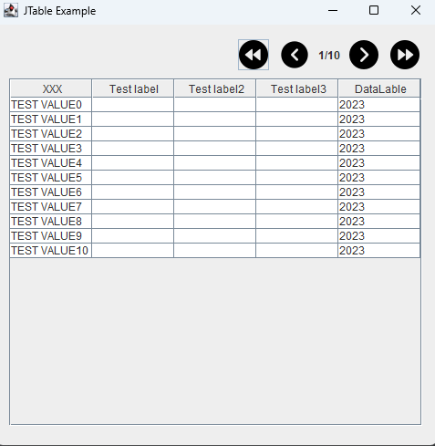

Simple tool to map Entity to table in java 
@Author Kamil Krzywanski

It's olny idea at the moment but by annotations you can create simple table
like there: 
@annotation @MyTableColumn make entity "table-friendly"

With default constructor you can provide data from list of entities

Effect of this opperation will be:  
