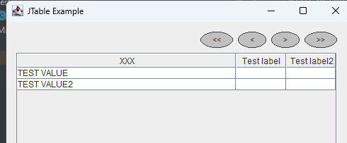
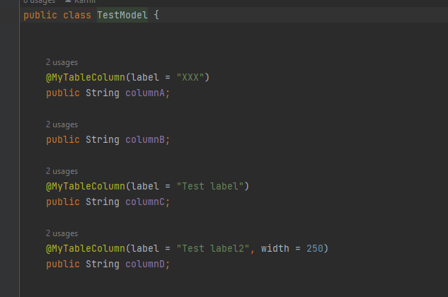

Simple tool to map Entity to jtable in java 
@Author Kamil Krzywanski  
-You can hide columns  
-Add filters, custom filters  
-Export to excel, csv  
-Define sortables columns  
-Simlplify add custom formatters  
-Autosave of columns visibility and width  

It's olny idea at the moment but by annotations you can create simple table
like there with export to CSV, EXCEL, Sort mechanism: 
@annotation @MyTableColumn make entity "table-friendly"

With default constructor you can provide data from list of entities

Effect of this opperation will be:  

Custom formatter for objects example:

Incoming features:
- crud operations on table
- add select and multiselect panel(needs to make fields editable)
-
