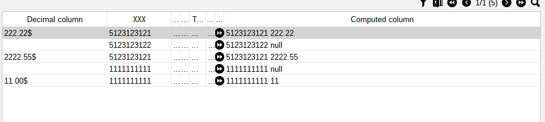

[Back to readme](../../../readme.MD)

# Computed columns

## Description

By this function you can create computed columns for the table with functional style.

## Usage

To create computed column you need to provide the name of the column, class of column, the function that will compute
the value.

```java 
static {
    panel.addComuptedColumn("Computed column", String.class, value -> value.getColumnA() + " " + value.getColumnB());
}
```

