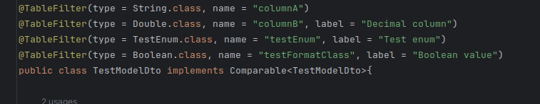
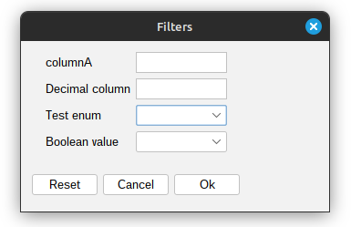
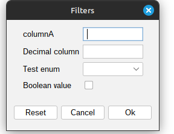

[Back to readme](../../../readme.MD)

# Filrers

## Description

By this function you can filter the table by the values of the columns.
To create new you need to annotate your entity with @TableFilter and provide the name of the column you want to filter.



With these annotations TypedTable will create filters panel with input fields for each column you want to filter.


When you click on the filter button, the table will be filtered by the values you entered the input fields.
Filter values will be passed by Map<String, String> extraParams
from [DataProviderInterface](../../../typedTable/src/main/java/org/krzywanski/table/providers/DataProviderInterface.java)

##Custom filters
You can register custom filters by 2 ways:

1. Global registration of filter for some type
    - Create a class that implements IFilterComponent
    - Use method: FilterDialog::registerCustomFilterComponent(Class<?> typeClass, Supplier<IFilterComponent> component)
    - Provide for which class you want to register the filter and the filter itself
    - Annotate your entity with @TableFilter and provide the name of the column you want to filter. Param type =
      typeClass (the same as in the first step)
2. Local registration of filter for some column - for only one instance
    - Create a class that implements IFilterComponent
    - Use method: TypedTablePanel::addCustomFilterComponent(String label, String filterName, IFilterComponent
      IFilterComponent)

## Example

```java
org.krzywanski.table.components.FilterDialog registerCustomFilterComponent(Boolean .class, () ->new

IFilterComponent() {
    private final JCheckBox checkBox = new JCheckBox();
    @Override
    public String getFilterValue () {
        return checkBox.isSelected() ? "true" : "false";
    }

    @Override
    public Component getComponent () {
        return checkBox;
    }

    @Override
    public void clear () {
        checkBox.setSelected(false);
    }
});
```

With this code you will have checkbox filter for boolean columns instead of combobox filter.


