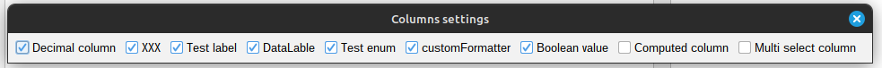

[Back to readme](../../../readme.MD)

# Hide Column

## Description

By this function you can hide a column from the table.

## Usage

Right-click on the column header and select "Hide current column" from the context menu.
If you want to show the column again, you can do it by right-clicking on the table header and selecting "Column
settings" from the context menu.
Then you will see a list of hidden columns. You can show the column by clicking on the checkbox next to the column name.

