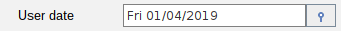

# Custom fields

## Description

Custom fields are fields that are not implemented in default panel. You can provide your own fields by providing custom
editor for your field.

### Basic usage

There are two ways to provide custom fields for your panel:

#### 1. Provide global custom editor for your field

You can provide global custom editor for your field by invoking method:

```java
static {
    TypedPanelFields.registerField(Date.class, new DefaultFieldProvider<>(new JXDatePicker(), component -> new DateValueController(component)));
}
```

With this method you can provide global custom editor for your field. In this example we provide custom editor for Date
field.



#### 2. Provide custom editor for your field in your panel

You can provide custom editor for your field in your panel by invoking method:

```java
static {
    autoPanel.addDataEditor("testFormatClass", TestFormatClass.class, new TableValueController<>(selectPanel, "Select format class"));
}
```

With this method you can provide custom editor for your field in your panel. In this example we provide custom editor
for TestFormatClass field.

