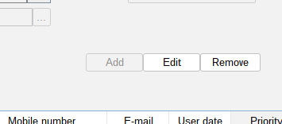

# Operations Validator

## Description

Operations validator is a feature that can be used to validate if the user can perform CRUD operations on the entity.

### Basic usage

To validate if user can perform CRUD operation on the panel you need to invoke method:
Available methods:
TypedAutoPanel::addUpdateValidator(Function<T, Boolean> validate, Supplier<String> message)
TypedAutoPanel::addInsertValidator
TypedAutoPanel::addRemoveValidator

```java
static {
    TypedAutoPanel<TestModelDto> autoPanel = new TypedAutoPanel<>(TestModelDto.class);
    autoPanel.addInsertValidator(new DefaultControllerValidator<>((r) -> !"M".equals(r.getColumnA()), () -> "ERROR"));
}
```

When field is not valid you will get message tooltip on button.

