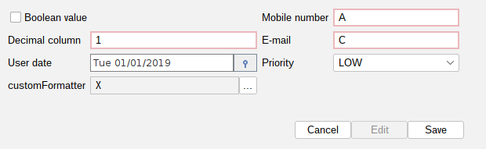

[Back to readme](../../../readme.MD)

# Typed Panel

## Description

Simple tool for map your entity to panel with CRUD operations.

### Basic usage

- Add custom fields to panel [Custom fields](customfields/customfields.md)
- Validation of fields with Jakarta Validation API [Validation](validation/validation.md)
- Validators for allows CRUD operations (Can insert, delete,
  edit) [OperationsValidator](operationsValidator/operationsValidator.md)

Default panel have implemented basic fields for your entity. You can also provide custom fields.
Default implemented are:
- String
- Integer
- Double
- Boolean
- BigDecimal
- Float
- Long
- Short
- User defined objects with table select [TableSelect](tableselect/tableselect.md)
  //Date and other Time related fields are not implemented because of lack of default components for them.

Implementation of own fields is possible by providing custom editor for your field. Example of usage:

### Example of usage
```java
import javax.swing.*;

public class TestDialog {

    public static void main(String[] args) {
        JDialog dialog = new JDialog();
      TypedAutoPanel<TestModelDto> autoPanel = new TypedAutoPanel<>(() -> table.getSelectedItem(), TestModelDto.class);

        // Set data flow adapter implements DataFlowAdapter<T>
        autoPanel.setDataFlowAdapter(new TestModelService());

        //You can also provide functional style crud operations separately:
        /**
         TypedAutoPanel::setInsertRepository(Insert<T> insertRepository);
         TypedAutoPanel::setRemoveRepository(Remove<T> removeRepository);
         TypedAutoPanel::setUpdateRepository(Update<T> updateRepository);
         **/

        //Add panel to dialog
        dialog.add(autoPanel.buildPanel(2), "wrap");
    }
}
```

For this code you will get panel like on screen below:


#### Change data for panel

To change current data for you panel you can invoke method:

```java
static {
  autoPanel.updateCurrentData(new TestModelDto());
}
```