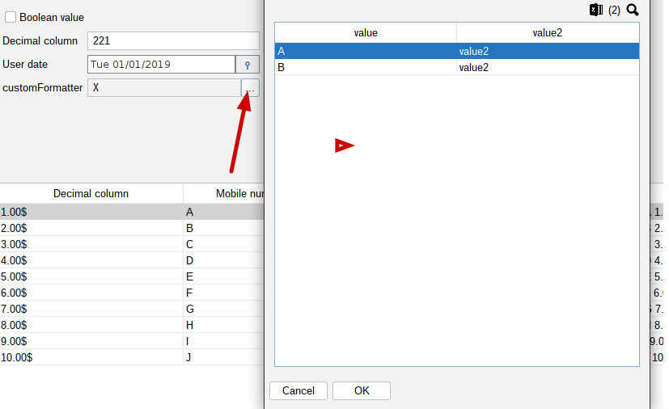

[Back to readme](../readme.MD)

# Table Select

## Description

Table select is a component that allows you to select an object from a table of objects. It is used in the Typed Panel
to
select an object from a list of objects.

### Basic usage

```java
static {
    //CREATES BASIC TYPED TABLE PANEL
    autopanel = new TypedAutoPanel<>(TestModelDto.class);

    TypedTablePanel<TestFormatClass> selectPanel = TypedTablePanel.getTableWithData(List.of(new TestFormatClass("A"), new TestFormatClass("B")), TestFormatClass.class);
    autoPanel.addDataEditor("testFormatClass", TestFormatClass.class, new TableValueController<>(selectPanel, "Select format class"));

    //... other operations on autoPanel
}
```


