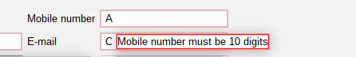

# Validation

Validation of fields with Jakarta Validation API

## Basic usage

To validate fields with Jakarta Validation API you need to provide your entity with jakarta validation annotations.
Fields will be validated while editing form.
Whole bean will be validated while saving.
Implementation of jakarta validation is provided by hibernate-validator library.

### Translations

You can provide own translations for validation.
To do this you need to provide your own {validationFilename}.properties file in your resources directory.
Then you can use properties as a translation for your validation messages.
example of validation.properties file:

```java
static {
    TypedFrameworkConfiguration.addResourceBundle({validationFilename});

    //EXAMPLE OF VALIDATION FILE TestModelDto.properties
    TypedFrameworkConfiguration.addResourceBundle("TestModelDto");
}
```

### Example of usage

```java
static {
    @NotEmpty(message = "{field.not.empty}")
    @Pattern(regexp = "(^$|[0-9]{10})", message = "{mobile.number.10.digits}")
    @MyTableColumn(label = "Mobile number", width = 200, sortable = true)
    private String columnA;
}
```

For this field you will get validation message like on screen below:
