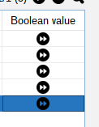

[Back to readme](../../../../readme.MD)

# Custom renderers

## Description

By this function you can create custom renderers for the fields of the table.

## Usage

To enable custom renderers you need to annotate your entity with @CustomRenderer(renderer = {? extends
TableCellRenderer})
i.e.

```java

@MyTableColumn(label = "Boolean value", sortable = true)
@CustomRenderer(renderer = BooleanIconRenderer.class)
private Boolean columnB;
```

```java
public class BooleanIconRenderer extends DefaultTableCellRenderer {
    static final Icon trueIcon = new ImageIcon(ClassLoader.getSystemResource("fast-forward-button.png"));
    static final Icon falseIcon = new ImageIcon(ClassLoader.getSystemResource("fast-backward.png"));
    static final Icon nullIcon = new ImageIcon(ClassLoader.getSystemResource("search.png"));

    public BooleanIconRenderer() {
        super();
        setHorizontalAlignment(CENTER);
    }

    @Override
    protected void setValue(final Object value) {
        if (value instanceof Boolean) {
            final Boolean b = (Boolean) value;
            if (b) {
                setIcon(trueIcon);
            } else {
                setIcon(falseIcon);
            }
        } else {
            setIcon(nullIcon);
        }
    }
}
```

With this code, the table will use the BooleanIconRenderer to render the columnB field.

