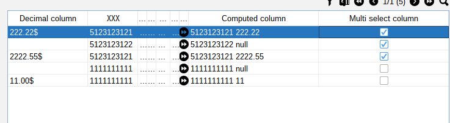

[Back to readme](../../../../readme.MD)

# Multi select

## Description

By this function you can enable multi select for the table.

to enable multi select you need to invoke method:

```java
import java.lang.reflect.Type;
import java.util.TreeSet;

static {
    TreeSet<Type> selectedItems = new TreeSet<>(); // MUST BE COMPARABLE
    panel.addMultiSelectColumn("Multi select column", selectedItems);
}
```

Collection of selected items must be comparable.
Collection will be updated by the table.
